# K9 Sisters

## About K9 Sisters
K9 Sisters is a website for dog sitting services in Amsterdam-West. It is my first project as part of the Diploma in Software Development at Code Institut.

The K9 Sisters project is a user centric (static) Front-End Development website for dog sitting services in Amsterdam-West and sorroundings. It is targeted at dog owners who live and/or work in Amsterdam-West and who make use of dog sitting services regularly or esporadically. 

Link to deplyed website: [K9 Sisters](https://anabramos.github.io/k9sisters-project/)

### Comment to myself: add mockup images

## Features

### Navigation Bar
- The navigation bar is situated at the top of the page, with the logo of the K9 Sisters to the left and the menu to the right. The menu brings the visitor to the 4 main pages of the website: Home, Services, Booking, and Blog. 
- An orange underline appears static under the menu page the visiot is current in to give clarity of the navigation. A thicker orange underline appears when the mouse hovers on the other pages that are currently not opened (active).
- The K9 Sisters logo also functions as an anchor link to the homepage.

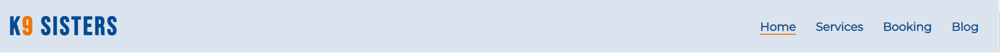

### Hero Image & cover text
- The hero image brings a very clear picture of the focus of the website together with its cover text. Here a visitor immediately knows what are the k9 Sisters and what they will be able to find in this website.
- A short animation is present in the cover text to call the atention of the visitor to the message on the text.
- For the mobile version, in the cover text we see only the name of the company not to echo with the hero image.

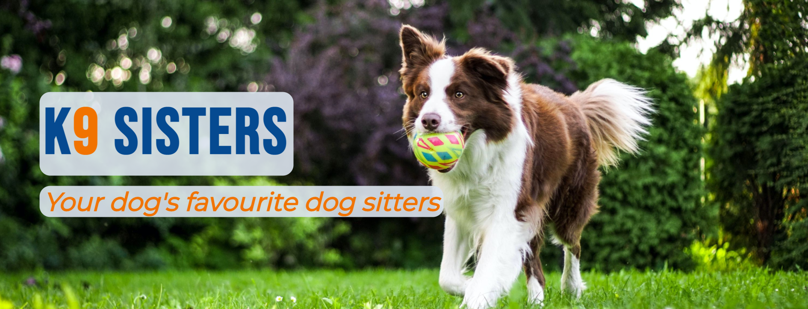

### About Us section
- The about us section presents to the visitor the people behind K9 Sisters in a nice and funny way as well as the mission of the company. The text is accompanied by an old image of the two sisters who started out the K9 Sisters.
- At the end of the About us section, visitors are invited through a link to book a free meet and greet with the K9 Sisters.

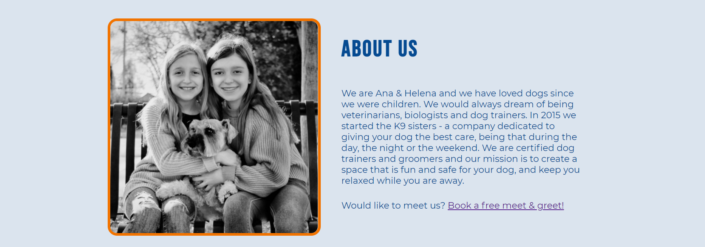

### What we offer section
- In this section the visitor is offered a small teaser of some of the services offered by the K9 Sisters. 
- The link under the three examples invites the visitor to check the overview of all services provided. 

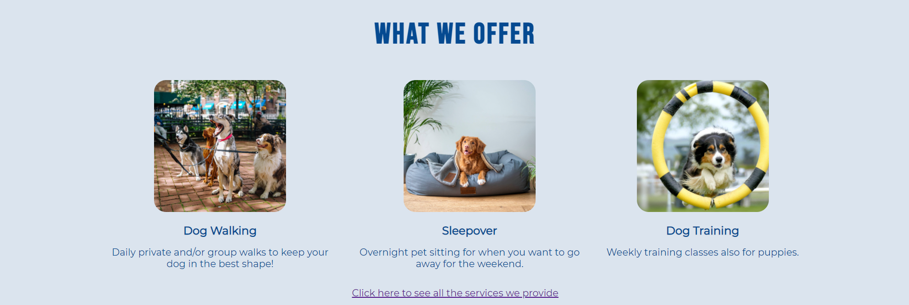

### Testimonials section
- Here the visitor can read testimonials of existing clients (dogs and humans) that support and validate the brand. 

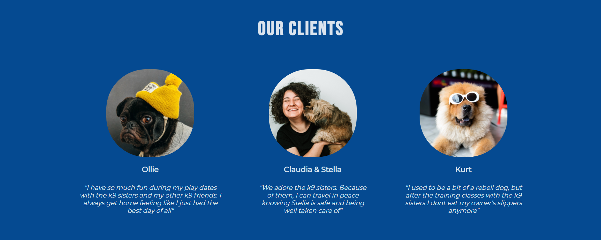

### Newsletter section
- The newsletter section has an e-mail input field to collect subscriptions to the newsletter. 
- The newsletter subscription gives the visitor access to unique content including discounts on the services.
- When submitting a newsletter, the visitor is directed to a confirmation page.

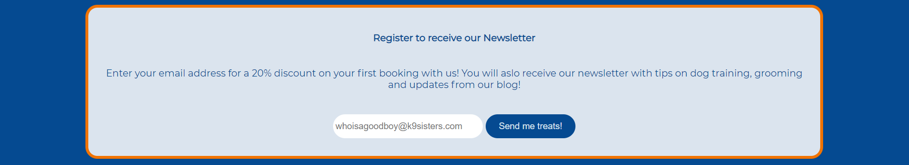

#### Newsletter confirmation section
- The user receives a confirmation message that his subscription has been received. 
- A button is also offering the user to return to the homepage

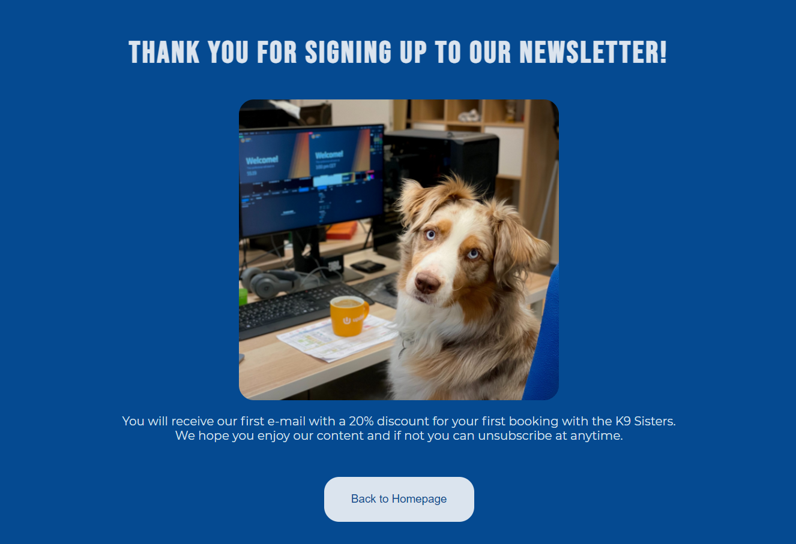

### Contact Us section
- The contact us section provides information on how one can get in contact with the K9 SIsters via: telephone, e-mail and address. 
- It also provides with an iframe map of the location where the business is located for reference and facilitating the visualization of the address in Amsterdam West.

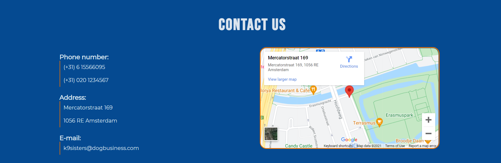

### Footer
- The footer will re-direct the user to our respective social medias by opening the external pages in a new tab on the browser. 
- The footer also credits the creator of the website. 

### Services page
- In the services page visitors can access the full overview of services provided by the K9 Sister company as well as the prices per service. 

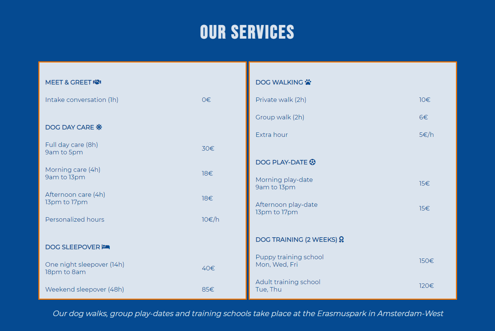

### Booking page
- In the booking page there is a form for users to book their services as prefered. All fiels are required for the booking except the 'allergies' field since this field might also not apply. 
- The form collects data related to the owner (contact details) the dog (general details) and the service the costumer is booking (type of service, date of service and paymenth method of choice).
- After filling in the form, the costumer can submit the form or clear (reset) its content.
- When a form is submitted,  the visitor is directed to a confirmation page.

    #### Booking confirmation
    - The user receives a confirmation message that his booking has been confirmed. 
    - A button is also offering the user to return to the homepage

    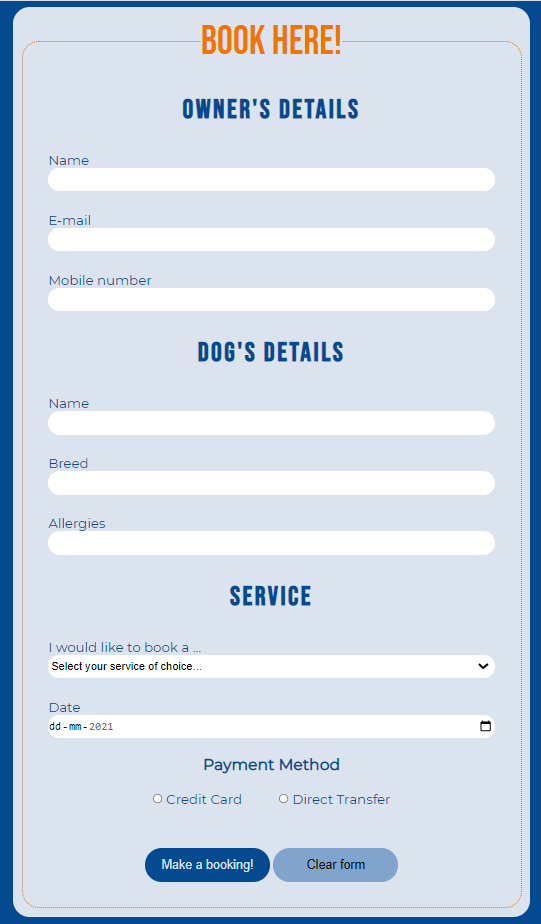
    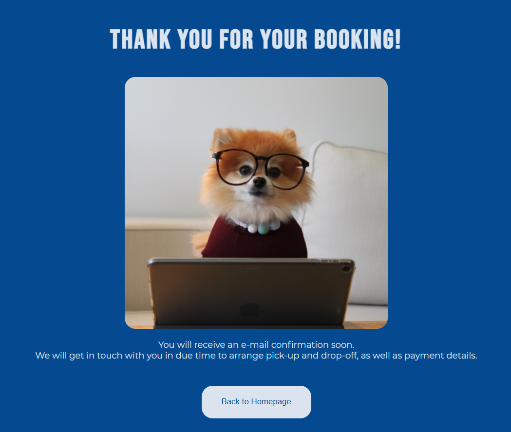

### Blog page
- In the blog page visitors can have access to a range of dog related content, created by the K9 Sistsers. 
- By scrolling down the visitor can see all published blog posts and click on 'continue reading' to open the entire article on a new page. 
    #### Full Article page
    - The visitor ca read the full article content in this page.

    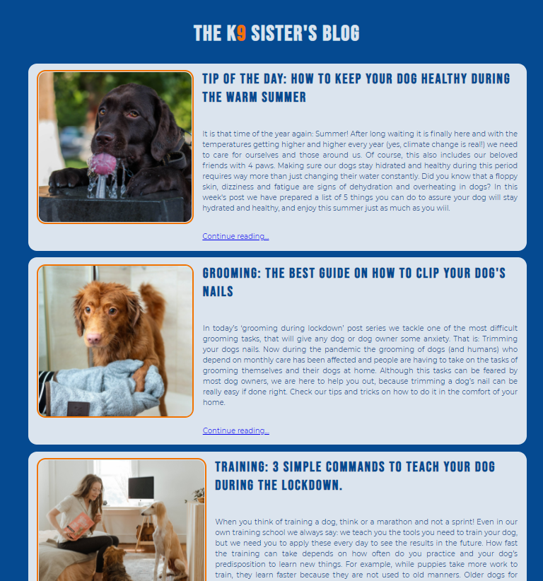
    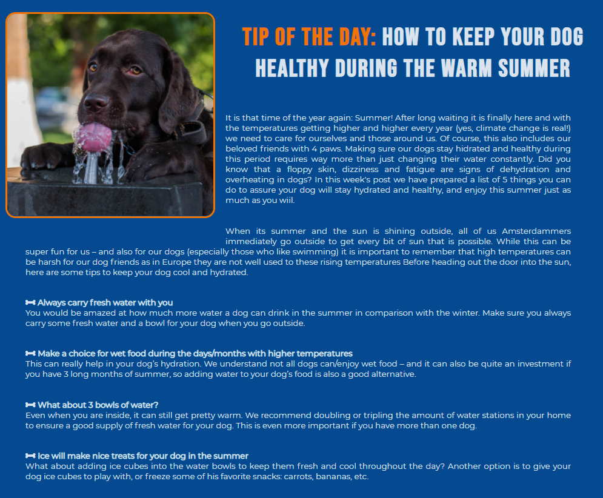

## Testing

### Validator Testing

#### HTML
- No errors or warnings returned from the [W3C Markup Validator Service](https://validator.w3.org/)

#### CSS
- No errors or warnings returned from the [W3C CSS Validator Service](https://jigsaw.w3.org/css-validator/)

#### Accessibility
- The color pallet and contrast for the website was tested on [WebAIM](https://webaim.org/resources/contrastchecker/)
- The website has been tested on lighthouse for accessibility. 
    - index.html
        
        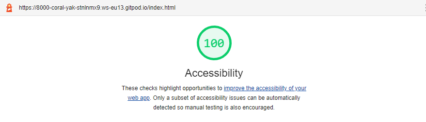

    - services.html

        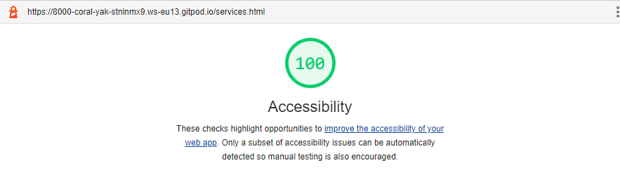

    - booking.html

        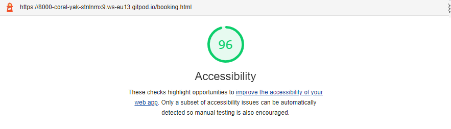

    - blog.html

        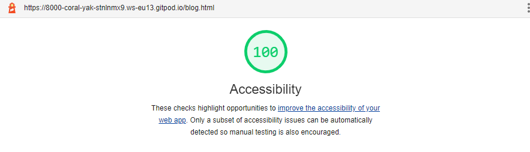

    - booking-confirmation.html

        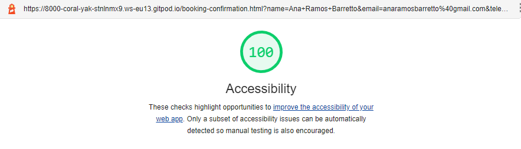

    - newsletter.confirmation.html

        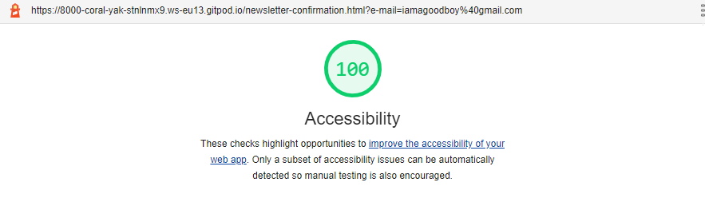

    - blog-post-1.html/ blog-post-2.html/ blog-post-3.html/ blog-post-4.html

        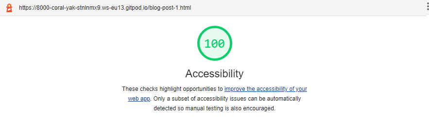

## User Experience (UX)
The user experience for the website is build with 3 personas in mind. Each persona presents a different user story and different goals when accessing the website. 

### Personas 
- Persona 1: Frequent costumer
- Persona 2: Sporadic costumer
- Persona 3: Potential costumer (first time visitor)

### User stories

A Frequent consumer:
- I already know the brand and make use of their services on a regular basis.
- I trust and vouch that their service is of quality.
- I want to be directed to the booking form quickly. 
- I want to receive tips and updates related to their blog and potential holiday discounts. 

A Sporadic consumer:
- I already know the brand and make use of their services sporadically.
- I trsut their service is pf quality.
- I want to check the prices of the services easily as I may have forgotten it since my last booking.
- While in the website, I might be interested in reading their latest article piece with tips on how to care for my pup.

A Potential consumer:
- I am a first time visitor to the website. I do not know the brand and have never used their services.
- I do not trsu the brand (yet) abd would like to be convinced they are trustworthy.
- I want to have a clear overview of the services provided. 
- I want to be able to meet the people who will take care of my dog before making a decison.
- I want to have a financial incentive to commiting with my first booking.

K9 Company goals with the website:
- Attract more costumers
- Generate returning costumers
- Demonstrate professionalism, competence and qualification in the services provided
- Get potential costumers to sin to our newsletter and book a meet & greet session

## Design

- Colors
    - The webiste colors are inspired by the complimentary colors of orange and blue. It uses different shades of blue to create contrast between text and background, and the orange is used to reinforce borders and highlight certain features/sections in the website. 
    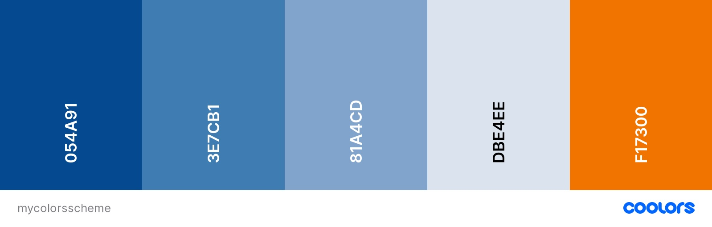

- Fonts
    - The website uses a combination of Bebas Neue & Montserra fonts, with a fall back to sans-serif. These fonts are popularly paired together. Bebas Neue is used in the website for high-level headings while Montserra is used for regular text and low level headings. The fonts were compared and taken from [Google Fonts](https://fonts.google.com/)

- Icons
    - This website makes use of icons from Font Awesome to give a new visual element and reinforce the content already displayed. The Icons are used to indicate social media links on the website's footer and make a distinction in the types of activities/services provided by the K9 Sisters.

## Technologies Used

- Languages
    - [HTML5](https://en.wikipedia.org/wiki/HTML)
    - [CSS](https://en.wikipedia.org/wiki/CSS)

- Libraries & Frameworks
    - [Google Fonts](https://fonts.google.com/)
    - [Font Awesome](https://fontawesome.com/)

- Tools
    - [Gitpod](https://www.gitpod.io/)
    - [Github](https://github.com/)
    - [Google Chrome Developer Tools](https://developer.chrome.com/docs/devtools/)
    - [Moqups](https://moqups.com/)
    - [Coolors (color schemes generator)](https://coolors.co/)
    - [Unsplash](https://unsplash.com/)
    - [W3C HTML Validation Service](https://validator.w3.org/)
    - [W3C CSS Validation Service](https://validator.w3.org/)
    - [Am I Responsive?](http://ami.responsivedesign.is/)
    - [WebAIM](https://webaim.org/resources/contrastchecker/)

 ## Credits

- Content
 
    - For the booking form input field type "tel" I have used the pattern attribute value provided by [Martin Wolf](https://martinwolf.org/before-2018/blog/2015/04/html5-telephone-input-validation/) 2015. This assured that only numeric numbers in a certain pattern could be inputed into the form.  
    
    - All other code was written by myself: Ana Ramos Barretto

- Media

    - All images for this website were taken from [Unsplash](https://unsplash.com/).

        - index.html

            - Hero-image: Photo by [Anna Dudkova](https://unsplash.com/@annadudkova) 

            - Two young girls holding a dog: Photo by [Leah Hetteberg](https://unsplash.com/@leahhetteberg) 

            - Four dogs on a leash in a park: Photo by [Matt Nelson](https://unsplash.com/@mnelson) 

            - Brown short coated sog lying on a grey dog bed under a blanket: Photo by [Jaime Street](https://unsplash.com/@jamie452) 

            - Border Collie jumping through a yellow training hoop: Photo by [Andrea Lightfoot](https://unsplash.com/@andreaelphotography)

            - Dog wearing a shirt and a hat: Photo by [Charles Deluvio](https://unsplash.com/@charlesdeluvio) 

            - Hairy dog kissing woman in black shirt: Photo by [Tamas Pap](https://unsplash.com/@tamasp) 

            - Long-coated brown dog wearing sun glasses: Photo by [Alan King](https://unsplash.com/@alanking) 

        - booking-confrimation.html

            - Brown and white pomeranian working on an iPad: Photo by [Cookie de Pom](https://unsplash.com/@cookiethepom) 

        - newsletter-confirmation.html

            - Brown and white long haired dog sitting on a desk with 2 screens: Photo by [Pavel Herceg](https://unsplash.com/@pavelherceg)

        - blog.html

            - Brown labrador retriever drinking water from a fountain: Photo by [Rafael Ishkhanyan](https://unsplash.com/@rafael_ishkhanyan)

            - Brown long coated dog drying paws on blue towel: Photo by [Jaime Street](https://unsplash.com/@jamie452) 

            - Woman gives biscuits to two seated dogs: Photo by [Chewy](https://unsplash.com/@chewy)

            - Dog treats on wooden table: Photo by [Susan Q Yin](https://unsplash.com/@syinq)

## Acknowledgements

A huge thanks to my mentor Samantha Dartnall, the CI slack community and tutoring team, the Proud Unicorns hackathon team, and my friends who tested this website at least 1000x. 